  

# Hi there, I'm a developer 👋

### Go · Cloud Native · AI Infra · Web

**English** · [简体中文](./README.zh-CN.md)

Building with Go, Docker, Kubernetes, React, TypeScript, Tailwind CSS, and PostgreSQL.

---

### Tech stack

**Backend & Data**

**Cloud & Infrastructure**

**Frontend**

---

Thanks for stopping by!

<!-- Personalize the heading with your name. Add selected projects and contact links once ready. -->